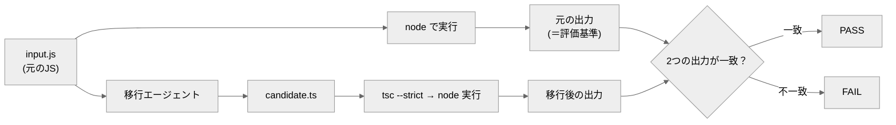

# js-to-ts-migration-agent

JavaScript を、**振る舞いを変えずに型つき TypeScript へ移行（migration）する**エージェントと、その移行が正しいかを自動で判定する**オラクル（採点プログラム）**。

## これは何？

言語の移行（古い言語 → 新しい言語）は「動いてるつもり」になりがちです。このリポジトリは、移行が正しいかを人手でなく**機械が判定するしくみ（テストオラクル）**を中心に置き、「先に合格条件を決めてから作る」**評価駆動開発（EDD）**の実例を示します。

判定方式は **差分テスト（differential testing）**：**元の JavaScript（input.js）を実際に実行し、その出力を「正解」とみなして**、移行後の TypeScript の出力がそれと一致するかで合否を出します。
正解を手で書かず「元のプログラム自身を物差しにする」ので、人手のズレが入りません。客観的で再現可能です（ただし判定は corpus に用意した入力での出力一致であり、あらゆる入力での等価を保証するものではありません）。

## クイックスタート

必要なもの：Node.js と Python 3。**コマンドはすべてリポジトリのルートで実行**します。初回だけ TypeScript を入れます（必須）：

```bash
npm install -D typescript
```

**(1) 同梱の正しい移行（reference）を採点** — エージェントを動かさなくても、移行物が採点される様子をすぐ確認できます：

```bash
python eval/oracle.py
```

→ 各ケースが PASS の表が出て、終了コード 0。

**(2) オラクル自身の健全性チェック**：

```bash
python eval/oracle.py --selftest
```

→ ①正しい移行は PASS、②わざと壊した移行は **FAIL が出るのが正常**、③控え（golden.txt）が元の実行出力と一致するかも点検。最後に次が出れば成功：

```
## オラクル判定: PASS（信頼できる外部オラクル）
```

## エージェントの動かし方（candidate の作り方）

`agent/js-to-ts-migration-agent.md` は **Claude Code 用のエージェント定義（指示書）** です。置いてあるだけでは動かず、呼ばれて初めて動きます。

- `input.js` を `candidate.ts` に移行させるには、この定義を **`.claude/agents/` に置いて名前で呼ぶ**か、定義の指示に従って**任意の LLM に移行させ**ます。
- 完全自動の1コマンドは用意していません（学習・手法実証が目的のため）。
- `candidate.ts` を用意できなくても、クイックスタート (1) の **reference** で全工程を再現できます。

エージェントが作った `candidate.ts` を採点するとき：

```bash
python eval/oracle.py --candidate candidate
```

## しくみ（どう合否を出すか）



つまり「**元(input.js)を実行した出力**」と「**移行後(candidate.ts)を実行した出力**」を突き合わせます（差分テスト）。

## 合否の基準（eval）

各ケースで「`tsc --strict` コンパイル成功 ＋ `node` 実行の標準出力が、**元の `input.js` を実行した出力**と完全一致」。

## ファイル構成

- `agent/js-to-ts-migration-agent.md` … エージェントの定義（システムプロンプト）。
- `eval/oracle.py` … 採点プログラム（差分テスト。`--selftest` 内蔵）。
- `eval/corpus/<ケース>/` … `input.js`（元のJS＝評価基準の素）/ `reference.ts`（正しい移行の見本）/ `golden.txt`（元の出力の控え・点検用）。
- `candidate.ts` … エージェントが生成する採点対象（`.gitignore` 対象。clone 直後は存在しません）。
- `design/design.md` … 設計の考え方・なぜ差分テストか・他言語への一般化。

---

自作 AI エージェント集（評価駆動開発の実証）の一つ。手法の背景は [design/design.md](design/design.md) を参照。
